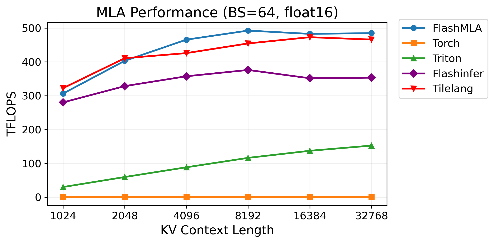
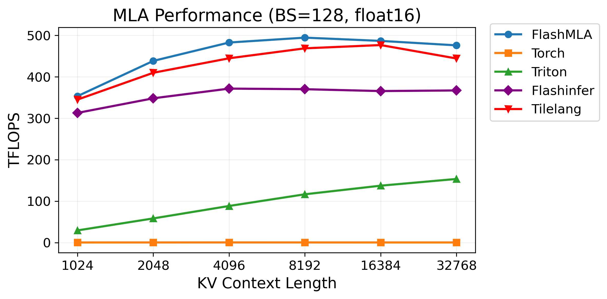
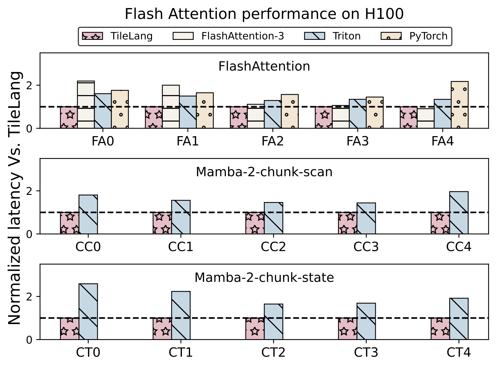
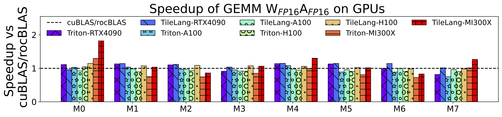
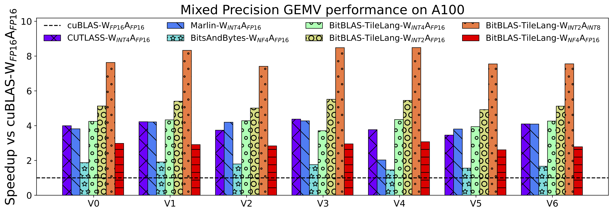

<div align="center">

# TileLang-Sunrise
[](https://badge.fury.io/py/tilelang)
[](https://deepwiki.com/tile-ai/tilelang)
[](https://discord.gg/TUrHyJnKPG)
[](https://github.com/tile-ai/tilelang-puzzles)
</div>

TileLang-Sunrise is the Sunrise S2/TANG backend distribution of [Tile Language (**tile-lang**)](https://github.com/tile-ai/tilelang), a concise domain-specific language designed to streamline the development of high-performance GPU/CPU/accelerator kernels (e.g., GEMM, Dequant GEMM, FlashAttention, LinearAttention). By employing a Pythonic syntax with an underlying compiler infrastructure on top of [TVM](https://tvm.apache.org/), TileLang-Sunrise allows developers to focus on productivity without sacrificing the low-level optimizations necessary for state-of-the-art performance.


## Upstream TileLang Latest News
- 02/02/2026 🧩: Check out [TileLang Puzzles](https://github.com/tile-ai/tilelang-puzzles), a fun and interactive way to learn TileLang programming with 10 progressively harder puzzles!
- 12/18/2025 🚀: Added [CuTeDSL backend](https://github.com/tile-ai/tilelang/pull/1421) support, enabling compilation to NVIDIA CUTLASS CuTe DSL! Join us in building and optimizing this exciting new backend: [Issue #1454](https://github.com/tile-ai/tilelang/issues/1454).
- 12/17/2025 🔬: Integrated [Z3 theorem prover](https://github.com/tile-ai/tilelang/pull/1367) into TVM Arith Analyzer, bringing SMT-based symbolic reasoning for enhanced optimizations and automatic correctness verification!
- 10/31/2025 🔧: Migrated to [apache-tvm-ffi](https://github.com/tile-ai/tilelang/pull/1108), significantly reducing CPU overhead!
- 10/30/2025 📦: We have released v0.1.6.post2, which is the last version compatible with Python 3.8.
- 10/07/2025 🍎: Added Apple Metal Device support, check out [Pull Request #799](https://github.com/tile-ai/tilelang/pull/799) for details.
- 09/29/2025  🎉: Thrilled to announce that ​​AscendC​​ and ​Ascend​NPU IR​​ backends targeting Huawei Ascend chips are now supported!
Check out the preview here:
🔗 [link](https://github.com/tile-ai/tilelang-ascend).
This includes implementations across two branches:
[ascendc_pto](https://github.com/tile-ai/tilelang-ascend) and
[npuir](https://github.com/tile-ai/tilelang-ascend/tree/npuir).
Feel free to explore and share your feedback!
- 07/04/2025 🚀: Introduced `T.gemm_sp` for 2:4 sparse tensor core support, check out [Pull Request #526](https://github.com/tile-ai/tilelang/pull/526) for details.
- 06/05/2025 ✨: Added [NVRTC Backend](https://github.com/tile-ai/tilelang/pull/461) to significantly reduce compilation time for cute templates!
- 04/14/2025 🚀: Added high-performance FlashMLA implementation for AMD MI300X, achieving performance parity with hand-optimized assembly kernels of Aiter! See [example_mla_amd](./examples/deepseek_mla/amd/README.md) for details.
- 03/03/2025 🚀: Added high-performance MLA Decoding support using only 80 lines of Python code, achieving performance on par with FlashMLA on H100 (see [example_mla_decode.py](./examples/deepseek_mla/example_mla_decode.py))! We also provide [documentation](./examples/deepseek_mla/README.md) explaining how TileLang achieves this.
- 02/15/2025 ✨: Added WebGPU Codegen support, see [Pull Request #86](https://github.com/tile-ai/tilelang/pull/86)!
- 02/12/2025 ✨: Excited to announce the release of [v0.1.0](https://github.com/tile-ai/tilelang/releases/tag/v0.1.0)!
- 02/10/2025 🚀: Added debug tools for TileLang—`T.print` for printing variables/buffers ([docs](https://tilelang.com/tutorials/debug_tools_for_tilelang.html)) and a memory layout plotter ([examples/plot_layout](./examples/plot_layout)).
- 01/20/2025 ✨: We are excited to announce that tile-lang, a dsl for high performance AI workloads, is now open source and available to the public!

## Tested Devices
TileLang-Sunrise supports Sunrise S2 accelerators through the TANG backend.

## OP Implementation Examples
**TileLang-Sunrise** provides the building blocks to implement a wide variety of operators. Some examples include:

- [Matrix Multiplication](./examples/gemm/)
- [Dequantization GEMM](./examples/dequantize_gemm/)
- [Flash Attention](./examples/flash_attention/)
- [Flash Linear Attention](./examples/linear_attention/)
- [Flash MLA Decoding](./examples/deepseek_mla/)
- [Native Sparse Attention](./examples/deepseek_nsa/)

Within the `examples` directory, you will also find additional complex kernels—such as convolutions, forward/backward passes for FlashAttention, more operators will continuously be added.

## Benchmark Summary

Upstream TileLang achieves exceptional performance across a variety of computational patterns. Comprehensive benchmark scripts and settings are available at [tilelang-benchmark](https://github.com/tile-ai/tilelang-benchmark). The selected results below are reproduced unchanged from upstream TileLang v0.1.13 and are not Sunrise S2 benchmark results:

- MLA Decoding Performance on H100

  <div style="display: flex; gap: 10px; justify-content: center;">
    <div style="flex: 1;">
      
    </div>
    <div style="flex: 1;">
      
    </div>
  </div>

- Flash Attention Performance on H100

  <div align="center">    
  </div>

- Matmul Performance on GPUs (RTX 4090, A100, H100, MI300X)

  <div>
    
  </div>

- Dequantize Matmul Performance on A100

  <div>
    
  </div>

## Installation
### Environment Dependencies

The Sunrise backend requires a compatible TANG Runtime, `torch_ptpu 0.2.3+torch 2.10`, and matching Triton packages. Configure the following paths for your local environment before installation:

```bash
TANGRT_LIB_PATH="/usr/local/tangrt/lib/linux-x86_64:/usr/lib64"
export LD_LIBRARY_PATH=${TANGRT_LIB_PATH}:$LD_LIBRARY_PATH
export STPU_TANGRT_PATH=/usr/local/tangrt

# Required by torch_ptpu; replace these paths for your local environment.
export PYTHON_INCLUDE_DIR=/path/to/python/include
export VENDOR_INCLUDE_DIRS=/usr/local/tangrt/include
export PTPU_PATH=/path/to/python/site-packages/torch_ptpu
```

### Build from Source

Install the required system dependencies, then install TileLang-Sunrise locally:

```bash
# install required system dependencies
sudo apt-get update
sudo apt-get install -y python3-setuptools gcc libtinfo-dev zlib1g-dev build-essential cmake libedit-dev libxml2-dev

pip install -e . -v # remove -e option if you don't want to install in editable mode, -v for verbose output
```

We currently provide three ways to install **TileLang-Sunrise** from source:
- [Install from Source (using your own TVM installation)](./docs/get_started/Installation.md#method-1-install-from-source-using-your-own-tvm-installation)
- [Install from Source (using the bundled TVM submodule)](./docs/get_started/Installation.md#method-2-install-from-source-using-the-bundled-tvm-submodule)
- [Install Using the Provided Script](./docs/get_started/Installation.md#method-3-install-using-the-provided-script)

## Quick Start

In this section, you'll learn how to write and verify a straightforward GEMM (matrix multiplication) kernel using TileLang-Sunrise on Sunrise S2.

### GEMM Example

The following example defines a GEMM kernel and validates its output against PyTorch.

```python
import tilelang
import tilelang.language as T
import torch


@tilelang.jit(out_idx=[-1], target="tang")
def matmul(M, N, K):
    block_M = block_N = 64
    block_K = 32

    @T.prim_func
    def gemm(
        A: T.Tensor((M, K), "float16"),
        B: T.Tensor((K, N), "float16"),
        C: T.Tensor((M, N), "float16"),
    ):
        with T.Kernel(
            T.ceildiv(N, block_N),
            T.ceildiv(M, block_M),
            threads=128,
        ) as (bx, by):
            A_shared = T.alloc_shared((block_M, block_K), "float16")
            B_shared = T.alloc_shared((block_K, block_N), "float16")
            C_local = T.alloc_fragment((block_M, block_N), "float")
            T.clear(C_local)

            for ko in T.Pipelined(T.ceildiv(K, block_K), num_stages=2):
                T.copy(A[by * block_M, ko * block_K], A_shared)
                T.copy(B[ko * block_K, bx * block_N], B_shared)
                T.gemm(A_shared, B_shared, C_local)

            T.copy(C_local, C[by * block_M, bx * block_N])

    return gemm


M = N = K = 1024
kernel = matmul(M, N, K)
A = torch.randn((M, K), device="ptpu", dtype=torch.float16)
B = torch.randn((K, N), device="ptpu", dtype=torch.float16)
C = kernel(A, B)
expected = torch.matmul(A.cpu(), B.cpu())
torch.testing.assert_close(C.cpu(), expected, atol=1e-2, rtol=1e-2)
print("GEMM correctness check passed.")
```

### Dive Deep into TileLang-Sunrise Beyond GEMM

In addition to GEMM, we provide a variety of examples to showcase the versatility and power of TileLang-Sunrise, including:

- [Dequantize GEMM](./examples/dequantize_gemm/): Achieve high-performance dequantization by **fine-grained control over per-thread operations**, with many features now adopted as default behaviors in [BitBLAS](https://github.com/microsoft/BitBLAS), which utilizing magic layout transformation and intrins to accelerate dequantize gemm.
- [FlashAttention](./examples/flash_attention/): Enable cross-operator fusion with simple and intuitive syntax, and we also provide an example of auto tuning.
- [LinearAttention](./examples/linear_attention/): Examples include RetNet and Mamba implementations.
- [Convolution](./examples/convolution/): Implementations of Convolution with IM2Col.

## Upcoming Features

Check the [upstream TileLang v0.2.0 release plan](https://github.com/tile-ai/tilelang/issues/79) for upcoming features.

---

Upstream TileLang has now been used in project [BitBLAS](https://github.com/microsoft/BitBLAS) and [AttentionEngine](https://github.com/microsoft/AttentionEngine).

## Join the Discussion

Welcome to join the upstream TileLang Discord community for discussions, support, and collaboration!

[](https://discord.gg/TUrHyJnKPG)

## Acknowledgments

We would like to express our gratitude to the [TVM](https://github.com/apache/tvm) community for their invaluable contributions. The initial version of this project was mainly developed by [LeiWang1999](https://github.com/LeiWang1999), [chengyupku](https://github.com/chengyupku) and [nox-410](https://github.com/nox-410) with supervision from Prof. [Zhi Yang](https://yangzhihome.github.io) at Peking University. Part of this work was carried out during an internship at Microsoft Research, where Dr. Lingxiao Ma, Dr. Yuqing Xia, Dr. Jilong Xue, and Dr. Fan Yang offered valuable advice and support. We deeply appreciate their mentorship and contributions.
